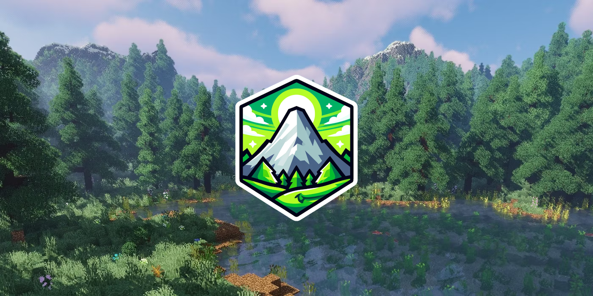

# Welcome to AugustaMC!

Welcome to the official **AugustaMC Wiki** — your guide to everything happening on our Network! 🌎

Whether you're a new explorer, a seasoned builder, or a community leader, this wiki will help you get the most out of your experience.

---

## :telescope: General Overview

The AugustaMC Network is a vibrant and dynamic Minecraft community designed to offer players a unique and engaging experience. Here's a quick look at what makes us special:

- 🎮 **High-Quality Gamemodes** – Enjoy a variety of well-crafted and engaging gameplay experiences.
- 😊 **Friendly Community** – Connect with players who value respect and collaboration.
- 🛠️ **Dedicated Staff** – Our team is here to ensure a smooth and enjoyable experience.
- 🔄 **Consistent Updates** – Stay excited with regular improvements and new features.

Whether you're here to build, compete, or just relax, AugustaMC has something for everyone. Dive in and start your adventure today!

## 🧭 What You'll Find Here

!!!
Quick Overview

- 🛡️ **Server Rules** – Stay informed about our expectations.
- 🌳 **Towny Survival** – Learn how to build, claim, and grow your town.
- ⚔️ **Jobs & Economy** – Discover ways to earn, trade, and thrive.
- 🏆 **Ranks & Progression** – See how you can level up your gameplay.
- 🎉 **Events & Competitions** – Stay updated on server-wide fun.
- 🔨 **Staff & Moderation** – Meet the team keeping AugustaMC safe.
  !!!

---

## 💬 Community First

At AugustaMC, we're more than just a server — we're a community.

- Build lasting friendships 🤝
- Collaborate on epic towns and nations 🏰
- Create your own story in a growing world 📜

We value **creativity, respect, and collaboration**. Every player helps shape the future of AugustaMC!

---

## 🚀 How to Get Started

If you're new, here's your first quest:

1. Read the [Server Rules](rules.md) 📜
2. Join or create a [Town](towny-guide.md) 🏘️
3. Pick a [Job](jobs-guide.md) and start earning 💰
4. Level up your [Rank](ranks.md) and unlock perks 🎖️
5. Have fun, meet others, and make your mark! 🌟

---

## 📢 Stay Connected

Join our Discord community to:

- Get real-time server announcements 📣
- Ask for help or advice 🙋
- Participate in giveaways, events, and more! 🎉

🔗 [Join the AugustaMC Discord](https://discord.gg/augustamc)

---

Thanks for being part of the journey.  
**Let's build something amazing — together!**
